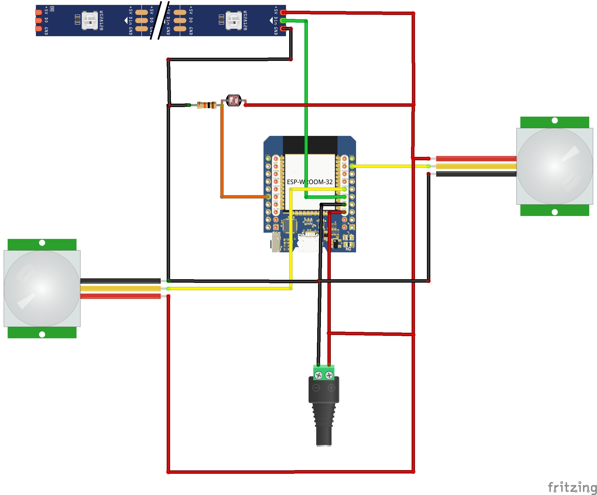

# DIY ESP32 motion activated hexagon stair lights

This ESP32 project controls a WS2812B addressable LED strip installed on the wall next to a staircase. The lighting is adjusted based on ambient light sensed by a Light-Dependent Resistor (LDR), providing a dynamic brightness to the LEDs so they are dimmer when it is darker and brighter when there is more light.
 
Motion sensors located at the top and bottom of the stairs detect movement. When motion is detected, the LEDs transition from a base hue incrementing rainbow pattern to a custom sequence:
1. All LEDs light up at half brightness in purple.
2. LEDs sequentially populate with an increased brightness in medium purple.

Video of it in action:

Wiring:

Special thanks to Giovanni Aggiustatutto for their writeup on constructing the hexagons:
https://www.instructables.com/DIY-Wooden-Nanoleaf-Light-Panels/
